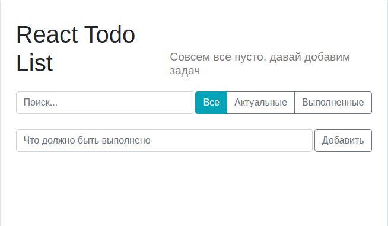
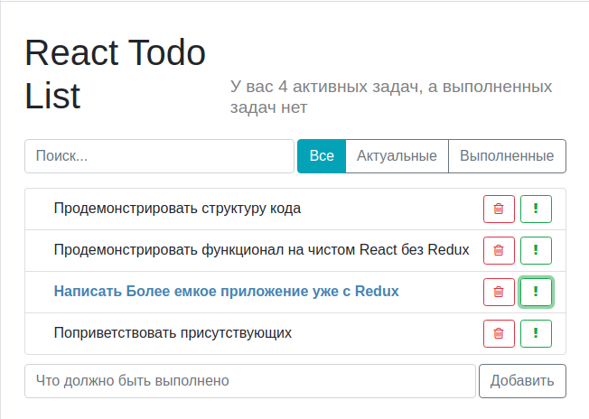
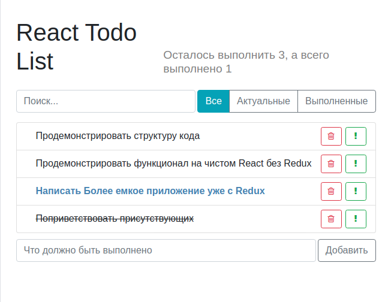
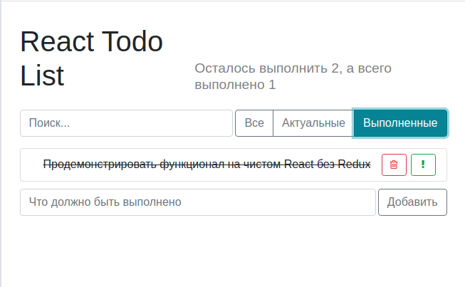
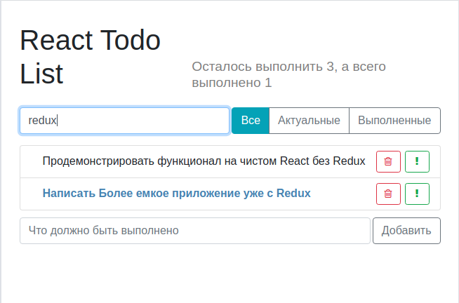

# Todo на React
Данное приложение написал для демонстрации кода на React, без использования Redux (это был квест, с Redux почти во всех других моих проектах).
Постарался затронуть основные аспекты работы с React и написать более менее чистый код.

Для скачивания проекта введите данную комманду  в консоль (при условии что у вас установлен git), или скачиваем вручную: 
```
git clone git@github.com:VladimirAppre/quick-todo-react.git
```
Устанавливаем npm зависимости, для этого в папку с проектом открываеv консоль и вводим комманду (у вас должна быть установлена Node.js):
```
npm i
```
Далее после того как успешно установились npm зависимсти, запускаем проект коммандой:
```
npm start
```

Если данные этапы прошли успешно, то "Ура, проект успешно запущен", и браузер автоматически должен открыть вкладку с адресом: ```http://localhost:3000/```
____


## Теперь перейдем к функционалу приложения:

*Рисунок 1. Начальная страница* 



----
*Рисунок 2. Добавление задач* 



Обращая внимание на интерфейс мы видем что тут реализованно: 
 + умный счетчик задач
 + задачи можно пометить как важные, нажимая на зеленый восклицательный знак
 + также видны списки, но это далее...
 ----
 *Рисунок 3. Выполненная задача* 
 
 
 
 Нажав на саму задачу, задача отмечается как выполненная
 
 ----
 
  *Рисунок 4. Фильтр задач* 
  
  
  
 ----
  
 *Рисунок 5. Поиск на соответствие* 
    
 
 
 Поиск работает на соответстие набранных символов, работает по изменение инпута и  не зависит он регистра
 
 ----
 На этом презентация приложения окончена
  ### Добро пожаловать в сам код
 

